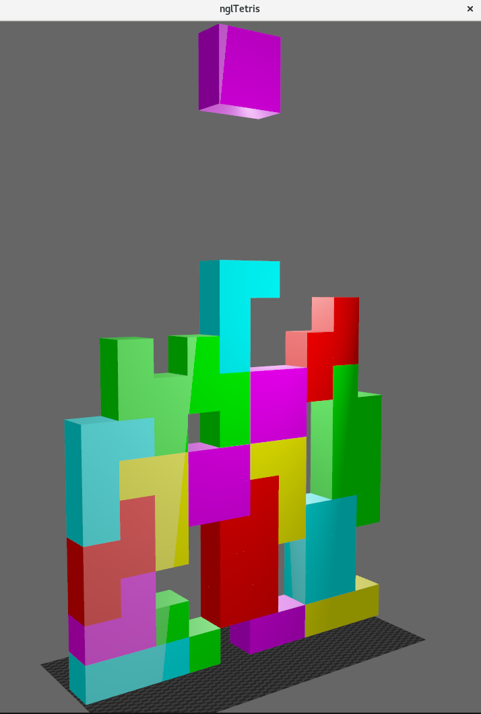

# nglTetris

https://github.com/NCCA/cfgaa24programingassignment-byoung5123/assets/149786837/e261d82d-073f-4c70-9e10-efcc11579bb9

This project demonstrates a basic implementation of Tetris mechanics, lit and rendered in OpenGL using the NGL graphics library.
The mechanics and tetromino types are taken directly from the original [Tetris](https://en.wikipedia.org/wiki/Tetris) game.
Additionally it uses Qt to display the window and handle user interations.

It uses NGLScene from [here](https://github.com/NCCA/SimpleNGL) to draw the scene every tick / whenever a block is moved.

# Building

Before you can build and run this project, you need to have the following installed:

  
    C++ compiler supporting C++17
    Qt5 or Qt6
    NGL (NCCA Graphics Library)
    vcpkg (for dependency management)

To build use

    mkdir build
    cd build
    cmake ..
    make

and to run use 

    ./nglTetris

# Controls

### Keyboard Controls

- **Arrow Up**: Rotate the tetromino clockwise.
- **Arrow Down**: Move the tetromino down faster.
- **Arrow Left**: Move the tetromino to the left.
- **Arrow Right**: Move the tetromino to the right.

### Mouse Controls

- **Left Mouse**: Drag to rotate around board.
- **Right Mouse**: Pan camera.

# Project Structure

- **'src/'**: Contains all **'.cpp'** source files
- **'include/'**: Contains all **'.h'** header files.
- **'shaders/'**: Contains GLSL shaders used by NGL.
- **'CMakeLists.txt'**: Contains CMake configuration for building the project.

# Key Components

- **NGLScene**: Manages the OpenGL context, drawing operations, and Qt window interactions.
- **Cube**: Handles the properties and rendering of cube objects.
- **Board**: Manages the game logic for the Tetris gameplay.
- **Tetromino**: Represents the individual Tetris pieces (Tetrominoes).

# Functionality/Improvements

### Current functionality:

- Tetrominoes move down each tick
- User can use arrow keys to move tetrominoes left, right and down and rotate them clockwise
- Consistent collision detection with board edges and other tetrominoes
- Clears full rows, moving all rows down once a row has been cleared and adding to the player score

### Potential improvements:

- Displaying player score on screen
- "Game over" state when tetrominoes can no longer spawn without overlapping
- Improve shading/background
